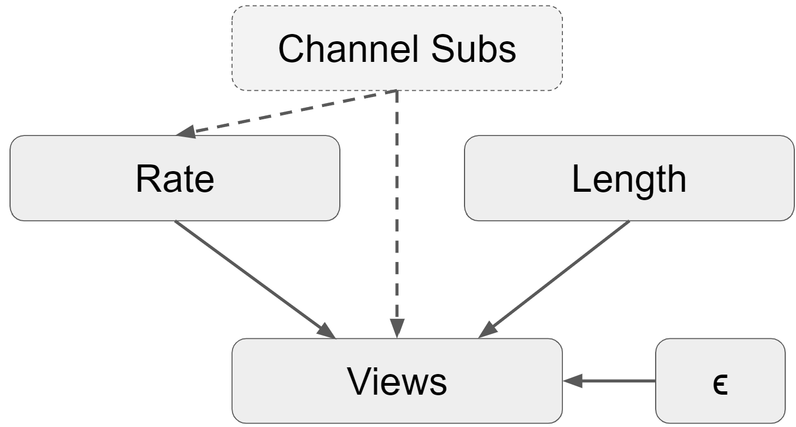

```{r setup, include=FALSE}
knitr::opts_chunk$set(echo = TRUE)
```

## Regression analysis of YouTube dataset

You want to explain how much the quality of a video affects the number of views it receives on social media.  **This is a causal question.**

You will use a dataset created by Cheng, Dale and Liu at Simon Fraser University.  It includes observations about 9618 videos shared on YouTube.  Please see [this link](http://netsg.cs.sfu.ca/youtubedata/) for details about how the data was collected.

You will use the following variables:

- views: the number of views by YouTube users.

- rate: the average rating given by users.

- length: the duration of the video in seconds.

You want to use the `rate` variable as a proxy for video quality.  You also include `length` as a control variable.  You estimate the following ols regression:

$$\text{views} =   789 +  2103    \text{ rate} +      3.00 \text{ length} $$


a. Name an omitted variable that you think could induce significant omitted variable bias.  Argue whether the direction of bias is towards zero or away from zero.

>We can think of a few omitted variables such as the ability to edit videos and create content from the author and those related to the YouTube channel of the video, particularly, the number of subscribers the channel has. The number of channel subscribers will help setting a baseline for the number of views, as the more subscribers the channel has, more people will be exposed to it. At the same time, people subscribed to the channel are more likely to like the kind content of the video, and thus more likely to increase the rate as well.
>
>Under these assumptions, the causal graph would be: 
>
>{width=50%}
>
> The real model will also contain the omitted variable:
>$$\text{views} = \beta_0 + \beta_1\cdot\text{rate} + \beta_2\cdot\text{length} + \beta_3\cdot\text{channel\_subscribers} + \epsilon$$
>And we can also try to capture the relationship between the omitted variable and the ones already included in the model:
>$$\text{rate} = \delta_0 + \delta_1\cdot\text{channel\_subscribers}+v$$
>
>The bias in this case will move the estimate away from zero, because the number of channel subscribers interacts positively with both views and the rate:
>$$\hat{\beta}_1 = \beta_1 + \beta_3\delta_1=(+) + (+)(+)$$
>
>Last, we may argue that this variable won't have a strong incidence in the length of the videos, and thus have a neutral interaction with that variable, adding no additional biases to the aforementioned.

b. Provide a story for why there might be a reverse causal pathway (from the number of views to the average rating).  Argue whether the direction of bias is towards zero or away from zero.

>One could argue that there exists a virtuous cycle between `views` and `rate`. Videos start increasing the number the views because their content resonates with the audience, making the `rate` go up. As the views start to increase, the YouTube algorithm starts to expose that video to more users, making the views go up even more. When the video gets more exposure, more users view it, and are drawn to fill out with a good rate, given the high rating it already has (i.e. anchoring bias). With more views, the video gets even more exposure and the cycle continues.
>
> This would change the causal graph in the following way:
>
>{width=50%}
>
>Such a reverse causality means that only one structural equation is no longer enough to estimate the causal effect with the outcome variable. Now our model needs to be specified by the following set of equations:
>
>$$\text{views} = \beta_0 + \beta_1\cdot\text{rate} + \beta_2\cdot\text{length} + \epsilon_1 \text{  (1)}$$
>$$\text{rate} = \gamma_0 + \gamma_1\cdot\text{views} + \epsilon_2 \text{  (2)}$$
>
> This implies that `rate` is a descendent of $\epsilon_1$ and dependent with it. Ultimately, this means that the equation (1) is not the true BLP, and OLS is no longer a good estimator for it. 
>
> As for the bias, $\gamma_1$ will add an effect to the true value of $\beta_1$ in the same direction than its sign. Given the virtuous cycle we explained above, we will argue that $\gamma_1>0$, and we will assume that $\beta_1>0$, given the nature of the relationship between `rate` and `views` and the estimate obtained. This would then introduce a _positive feedback_, and thus $\hat{\beta}_1>\beta_1$ 

c. You are considering adding a new variable, `ratings`, which represents the total number of ratings.  Explain how this would affect your measurement goal.

>The `ratings` would not only affect the views, but also the `rates`. This is because as you add more `ratings`, the `rate` of the video is subject to change. This would modify the causal graph: 
>
>{width=50%}
>
>This means that this new variable can be interpreted as an outcome variable. Although outcome variables do not break any of the technical assumptions behind OLS, it makes the the interpretation of the model unclear. For a linear regression, we say that a coefficient is the change introduced by a variable in the outcome variable, maitaining everything else constant. With an outcome variable present, we are breaking this interpretation, as one of the variables directly affects the other one, and thus makes the explanation of the model not very straightforward. In this particular case, `ratings` will have a direct influence in the `rate` of the video, and thus we can no longer say that the coefficient of the `rate` is the change induced by that variable in the views holding everything else constant.
>
>To solve this issue, it is recommended not to include outcome variables in the right hand side of the equation. It would be best to choose either the number of `ratings` or the video's `rate`, but not both, as explanatory variables.

