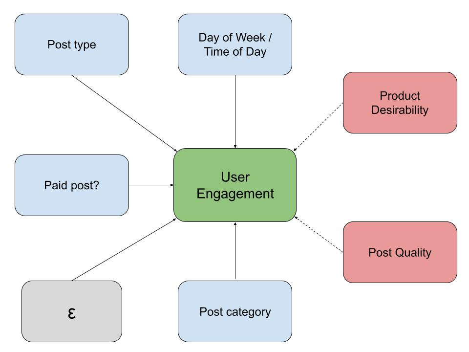

## 1 .Introduction

A company’s online presence is becoming increasingly important in recent times where Covid-19 has accelerated society’s digital transition. By posting interesting, relatable, or attention-grabbing content, a corporation can expect increased user engagement, ultimately leading to a product purchase or simply more brand recognition. A majority of modern social media platforms use algorithms to suggest content to users. At first, a particular post might be shown to users at random with equal likelihood as other posts. However if the post sees more user engagement than other similarly aged content, the algorithm will continue to suggest it to others, having a multiplicative effect. Therefore, given that a company wants to convey some message to the users, carefully choosing the type and category of content used will greatly affect the number of users reached and level of engagement. In this paper, we examine the research question: “Does the type and category of content posted on Facebook impact user engagement?”


```{r set.seed(1), include=FALSE}
knitr::opts_chunk$set(echo = TRUE)
```

```{r echo=FALSE, message=FALSE, warning=FALSE}
# imports
library(dplyr)
library(tidyverse)
library(ggplot2)
library(grid)
library(gridExtra)
library(sandwich) # need to install
library(lmtest)   # need to install
library(stargazer)
library(corrplot)

# read data
fb_data = read_delim("./datasets/dataset_Facebook.csv", delim=";")

# change col names
cols = c(
  "page_ttl_likes",
  "type",
  "category",
  "post_month",
  "post_wkday",
  "post_hour",
  "paid",
  "lifetime_post_reach",
  "lifetime_post_impressions",
  "lifetime_engaged_users",
  "lifetime_post_consumers",
  "lifetime_post_consumptions",
  "lifetime_post_impressions_from_page_have_likeds",
  "lifetime_post_impressions_from_page_likes",
  "lifetime_people_liked_engaged_with_post",
  "comments",
  "likes",
  "shares",
  "interactions"
)
colnames(fb_data) = cols

fb_data = fb_data %>%
  mutate(
    category_str = case_when(
      category == 1 ~ "Action",
      category == 2 ~ "Product",
      category == 3 ~ "Inspiration"
    ),
    period_of_day=case_when(
      post_hour >= 1  & post_hour <= 5  ~ "Overnight",
      post_hour >= 6  & post_hour <= 11 ~ "Morning",
      post_hour >= 12 & post_hour <= 17 ~ "Afternoon",
      post_hour >= 18 & post_hour <= 23 ~ "Evening"
    ),
    weekend=case_when(
      post_wkday == 1 | post_wkday == 7 ~ 1,
      TRUE                              ~ 0
    )
  ) %>% filter(!is.na(paid))

# split data
set.seed(1)
split = sample(c(rep(0, 0.7 * nrow(fb_data)), rep(1, 0.3 * nrow(fb_data))))
split = append(split, 1)
fb_data_exp = fb_data[split==1,]
fb_data_test = fb_data[split==0,]
```

## 2. Data

The dataset we will be using for this analysis is a subset of that collected by Moro et al. (2016). The dataset contains a representative sample of 500 Facebook posts from a worldwide renowned cosmetic brand, collected between January 1st and December 31st of 2014. By the time the data was collected, Facebook was the most used social website, with roughly 1.28 billion monthly active users (Insights 2014). 

Each observation from the dataset represents a post from this company, for which a variety of features have been collected.

Given the large sample size, we will use a randomized sub-sample of 150 observations for exploration purposes and the remaining 350 for running the models. The only anomaly in the variables of interest is one missing value for `paid` variable, which we will be removing from the analysis, leaving us with a total of 499 observations.

\begin{center}
  Randomized sub-samples
\end{center}

\begin{center}
  \begin{tabular}{l r}
    \hline
    Split     &  \\
    \hline
    Exploration & 150 \\
    Test        & 349             \\
    \hline
    Total       & 499             \\
    \hline
  \end{tabular}
\end{center}


### 2.1 Engaged users

The outcome variable will be the number of unique *engaged users* the post had through its lifetime. An engaged user is defined as someone who clicked in the post. Looking into this variable, we can see that it is fairly skewed to the right. To make the variable easier to work with, we will be applying a log transformation:

```{r echo=FALSE, message=FALSE, warning=FALSE}
p1 = fb_data_exp %>% ggplot() +
  aes(x=lifetime_engaged_users) +
  geom_histogram(bins=20, alpha=0.4, fill="blueviolet", color="blueviolet") +
  labs(x="Engaged Users")

p2 = fb_data_exp %>% ggplot() +
  aes(x=log(lifetime_engaged_users)) +
  geom_histogram(bins=20, alpha=0.4, fill="blueviolet", color="blueviolet") +
  labs(x="Lof of Engaged Users")

pb = fb_data_exp %>% ggplot() +
  aes(x=lifetime_engaged_users) +
  geom_boxplot(alpha=0.4, fill="blueviolet", color="blueviolet") +
  labs(x="Engaged users")

pb2 = fb_data_exp %>% ggplot() +
  aes(x=log(lifetime_engaged_users)) +
  geom_boxplot(alpha=0.4, fill="blueviolet", color="blueviolet") +
  labs(x="Log of Engaged Users")

grid.arrange(p1, pb, p2, pb2, ncol=2, nrow=2, top="Histogram and boxplot for the post's engaged users (normal and log)")
```


### 2.2 Category and Type
The main variables we want to measure the impact on engaged users are the `type` and `category` of the post. The `type` is categorized in Photo, Video, Link or Status, and it represents what kind of content the post contained. We can see that most of the posts published were photos:

```{r echo=FALSE, message=FALSE, warning=FALSE}
fb_data_exp %>% ggplot() + 
  aes(x=type) + 
  geom_bar(width=0.5, alpha=0.4, fill="blue", color="blue") +
  labs(
    title="Counts of posts by type",
    x="Post Type"
  )
```

On the other hand, the category describes how the content of the post was displayed to the user. There were 3 distinct categories the dataset differentiates:
  - Action: Special offers and contests
  - Product: Direct advertisement or explicit brand content
  - Inspiration: Non-explicit brand related content

The number of posts published of each category are as follows:

```{r echo=FALSE, message=FALSE, warning=FALSE}
fb_data_exp %>% ggplot() + 
  aes(x=category_str) + 
  geom_bar(alpha=0.4, width=0.5, fill="blue", color="blue") +
  labs(
    title="Number of posts by category",
    x="Post Category"
  )
```


### 2.3 Covariates

#### 2.3.1 Paid

Among the covariates we will be including in the model is paid advertising. The variable `paid` will be encoded as a dummy variable to indicate whether the post had any paid media associated with it or not. We can see that in the exploratory dataset, ~32% of all the posts had some kind of paid media support:


\begin{center}
  Paid media support
\end{center}

\begin{center}
  \begin{tabular}{l r}
    \hline
    Media Support   & Number of posts \\
    \hline
    No Paid support & 114             \\
    Paid support    & 36             \\
    \hline
    Total           & 150             \\
    \hline
  \end{tabular}
\end{center}


#### 2.3.2 Period of day and Day of the week

The last variables we will be including as control are the period of the day and the day of the week the post was published to account for the differences that may exist on user activity at different times and days. 

In particular, we will distinguish 4 periods of the day, overnight, morning, afternoon and evening. The first going from 12am to 6am, the second one from 6am to 12pm, then 12pm to 6pm, and 6pm to 12am. 

On the other hand, the days of the week will be divided into weekdays and weekends. This will be encoded in a dummy set to 1 if the period is a weekend.

```{r echo=FALSE, message=FALSE, warning=FALSE}
pod_plot = fb_data_exp %>% ggplot() + 
  aes(x=period_of_day) + 
  geom_bar(width=0.5, color="blue", fill="blue", alpha=0.5) +
  labs(
    x="Period of the day"
  )

wd_plot = fb_data_exp %>% ggplot() + 
  aes(x=weekend) + 
  geom_bar(width=0.5, color="blue", fill="blue", alpha=0.5) +
  labs(
    x="Weekend"
  )

grid.arrange(pod_plot, wd_plot, ncol=2, top="Distribution for  period of day and weekends")
```


## 3. Model

### 3.1 Base Model

As explained in the data section, we will be applying a log transformation to the outcome variable, engaged users. The base model will only include type and category as main explanatory variables:

\(
\widehat{\log(engaged\_users)}=\beta_0 + \beta_1 \text{ } type + \beta_2 \text{ } category
\)

```{r echo=FALSE, message=FALSE, warning=FALSE}
base_model = lm(log(lifetime_engaged_users) ~ 1 + 
                  type + category_str
                , data=fb_data_test)
```


### 3.2 Adding Covariates

With the base model established, we will be including as control variables paid media efforts, brand awareness, day of the week and period of the day. All these as described on the data section:

\begin{align*}
\widehat{\log(engaged\_users)}=\beta_0 &+ \beta_1 \text{ } type + \beta_2 \text{ } category\\ 
&+ \beta_3 \text{ } paid +\beta_4 \text{ } day\_of\_week + \beta_5 \text{ } period\_of\_day
\end{align*}


```{r echo=FALSE, message=FALSE, warning=FALSE}
covar_model = lm(log(lifetime_engaged_users) ~ 1 + 
                   type + category_str +
                   paid + 
                   period_of_day + weekend
                 , data=fb_data_test)
```

### 3.3 Adding Interaction term

As a next model, we will be including an interaction term to account to see how the different types behave when paired with the different categories:


\begin{align*}
\widehat{\log(engaged\_users)}=\beta_0 &+ \beta_1 \text{ } type + \beta_2 \text{ } category + \beta_3 \text{ } paid \\
& + \beta_4 \text{ } day\_of\_week + \beta_5 \text{ } period\_of\_day + \beta_6 \text{ } type*category
\end{align*}


```{r echo=FALSE, message=FALSE, warning=FALSE}
inter_model = lm(log(lifetime_engaged_users) ~ 1 + 
                  type*category_str + 
                  paid + 
                  period_of_day + weekend 
                , data=fb_data_test)
```


### 3.4 Standard Errors

We understand that certain dependencies may exist among the posts given that they are all from the same company. This means that the people that know the brand and interact with the social site and posts may be similar on the different posts.

Because of this reason, we will be using *robust clustered standard errors* to adjust the significance for any independence that may exist.

```{r echo=FALSE, message=FALSE, warning=FALSE}
# Standard Errors
base_model_clse = coeftest(base_model, vcov=vcovCL)[, "Std. Error"]
covar_model_clse = coeftest(covar_model, vcov=vcovCL)[, "Std. Error"]
inter_model_clse = coeftest(inter_model, vcov=vcovCL)[, "Std. Error"]

# Coefficients
base_model_coef = coeftest(base_model, vcov=vcovCL)[, "Estimate"]
covar_model_coef = coeftest(covar_model, vcov=vcovCL)[, "Estimate"]
inter_model_coef = coeftest(inter_model, vcov=vcovCL)[, "Estimate"]

# Pvals
base_model_p = coeftest(base_model, vcov=vcovCL)[, "Pr(>|t|)"]
covar_model_p = coeftest(covar_model, vcov=vcovCL)[, "Pr(>|t|)"]
inter_model_p = coeftest(inter_model, vcov=vcovCL)[, "Pr(>|t|)"]
```


## 4. Results

Results of the models described are shown in the table below:


```{r echo=FALSE, results='hide'}
results = stargazer(
  base_model,
  covar_model,
  inter_model,
  coef= list(base_model_coef, covar_model_coef, inter_model_coef),
  se = list(base_model_clse, covar_model_clse, inter_model_clse),
  p = list(base_model_p, covar_model_p, inter_model_p),
  dep.var.labels="log(Engaged Users)",
  type="latex",
  header=F,
  omit.stat="f",
  covariate.labels=c(
    "Type - Photo",
    "Type - Status",
    "Type - Video",
    "Category - Inspiration",
    "Category - Product",
    "Paid Media",
    "Period - Evening",
    "Period - Morning",
    "Period - Overnight",
    "Weekend",
    "Interaction - Photo:Inspiration",
    "Interaction - Status:Inspiration",
    "Interaction - Video:Inspiration",
    "Interaction - Photo:Product",
    "Interaction - Status:Product",
    "Interaction - Video:Product"
  )
)

results[2] = "\\begin{longtable}{@{\\extracolsep{5pt}}lccc}"
results[5] = ""
results[length(results)] = ""
results[length(results)-1] = gsub("tabular", "longtable", results[length(results)-1])
```


```{r echo=FALSE, warning=FALSE, message=FALSE, results='asis'}
cat(paste0(results), sep = "\n")
```


All the different types of posts are significant to an $\alpha$ level of 0.05 across all models, with Link being the omitted type. From the magnitude of the coefficients we can see that Video, Status and Photo perform much better than Link, with Status yielding the highest increase on engaged users. All these coefficients are quite stable across models as well. As for the categories, none of them are significant which is quite surprising.

The second model includes the covariates paid, period of the day and weekday. The results are similar to those of the base model. As expected, we see that paid comes as significant with a positive coefficient, although smaller in magnitude than any of the post types. Posting on weekends doesn't seem to be significant in any of the models but some of the periods do. With the omitted day period being the afternoon, we see that morning is highly significant and has a negative coefficient. This implies that the period of the day associated with higher engagement is the afternoon.

We ran a Wald Test between the base and the covariate models and it yields a low p-value, meaning that some of the covariates are helping to explain the variability of the engaged users. This phenomenon can also be appreciated in the coefficient of determination (i.e. $R^2$), as it jumps from 14% in the first model, to 17% after the addition of these covariates. 

```{r echo=FALSE, warning=FALSE, message=FALSE}
waldtest(base_model, covar_model, vcov=vcovCL)
```

When looking at the model with the interaction term and covariates, we see similar results than the previous one, but with a few modifications. The first thing we see is that now posting on weekends is significant to an $\alpha$ level of 0.1. We also see that the coefficient is negative, implying that posting during weekdays is associated with more engaged users.

Examining the interaction term, we notice that none of the terms are significant, which is quite surprising. Some of the coefficients are missing, implying high correlation between them.

Last, we examine the Wald Test between the model with covariates and the interaction model, and the high p-value indicates that the interaction term doesn't add explanatory power to the model. This can also be appreciated by the fact that the $R^2$ doesn't increase significantly from one model to another.

```{r echo=FALSE, warning=FALSE, message=FALSE}
waldtest(covar_model, inter_model, vcov=vcovCL)
```

### 5. Limitations of your Model 

#### 5a. Large-Sample Assumptions \newline
The sample size of 500 observations indicates that we must evaluate and consider the following large-sample assumptions as pertaining to our model.

1. Data is Independent and Identically Distributed (I.I.D)

It is evident that our posts dataset is not I.I.D. As all of the posts are being made by the same cosmetics company and on the same platform (Facebook), inevitably all posts will be linked to the same company's products and promotions. Although we do not have unique detail regarding each post, it's likely that multiple posts may be tied to the same product or promotion. Other post parameters (time/date) may also not be independent, depending on the marketing strategy the team employed at the time this study was performed. Lastly, the number of impressions on each post are not independent from one another as many of the engagements/interactions may be from the same followers of the page across multiple posts. 

Unfortunately, there is not much we can do to improve the raw data itself to reduce I.I.D. concerns. As all of the posts are anonymous we can't directly discern how to cluster or aggregate datapoints. Using robust standard errors may mitigate non-I.I.D. concerns and account for any heteroscedasticity in our model, although this is not an ideal solution. A Breusch-Pagan homoscedasticity test was run on our model - the high p-value above .05 means that we *fail* to reject $H_0$, meaning that we can't find enough evidence to say that homoscedasticity is not present. 

```{r}
bptest(inter_model)
```

2. Unique BLP Exists - No perfect collinearity

To satisfy this assumption, no variable in our model can be written as a linear combination of the other variables in the model. This assumption is satisfied given the following correlation matrix (one-hot encoding of the *type* and *category* variables was done to test correlation):
```{r echo=FALSE, warning=FALSE, message=FALSE}
fb_data = fb_data %>% 
  mutate(type_Photo = ifelse(type == "Photo", 1, 0),
  type_Status = ifelse(type == "Status", 1, 0),
  type_Video = ifelse(type == "Video", 1, 0),
  type_Link = ifelse(type == "Link", 1, 0))

fb_data = fb_data %>% 
  mutate(cat_Action = ifelse(category == 1, 1, 0),
  cat_Product = ifelse(category == 2, 1, 0),
  cat_Inspiration = ifelse(category == 3, 1, 0))

corrplot(cor(fb_data[c("lifetime_engaged_users", "post_wkday", "post_hour", "cat_Action", "cat_Product", "cat_Inspiration", "type_Photo", "type_Status", "type_Video", "type_Link")]),method="color")
```

#### 5b. Omitted Variables \newline \newline

**Intentionally omitted variables** 

Some variables were accessible within the dataset but were omitted, including:

- Total Page Likes
- Lifetime post total reach
- Lifetime post total impressions
- Lifetime post impressions by people who have liked the page
- Lifetime post reach by people who have liked the page
- Lifetime people who have liked page and engaged with post
- Comments
- Likes
- Shares

As our outcome variable *engaged users* is defined as the number of users who clicked on the post in question, we can see that many of the intentionally omitted variables are very similar in what they measure - most are defined as some metric of engagement. As we determined that *engaged users* would be the best-suited outcome variable for our model, as it was a more holistic summation of engagement than individual metrics such as *comments* or *post reach only by people who liked the page*. 

These variables that could be classified as outcome variables were omitted, as including these in the model would obscure the effects and relationships of the true measured variables. For example, we could have included "likes" as a covariate and examined its effect on user engagement. However, "likes" and engagement are directly related, and including this parameter in our model would absorb causal effect from other variables that we are trying to measure. 

**Unintentionally omitted variables**

Many other variables that may affect user engagement were not tracked in this dataset, as a result they are not able to be factored into our model. We would like to address some of these omitted variables below and discuss their potential impact on the model results. 

- Desirability of the product being marketed: 

Not all products that the company promotes on its page will be of equal desirability to its customers. For example, two posts of the same type and category (not to mention all of the other supporting covariates) could have wildly varying engagement figures depending on if the product was highly in-demand or not. If we had knowledge of the product/service being promoted in each post, we would be able to account for it in our model by factoring in parameters such as the sales figures of each product, market sentiment of each product, etc. (this information could likely be obtained from external sources). We would then be able to add sales figures or another product desirability metric into our model; promoting a more well-known product would likely lead to more engagement than a more obscure product, all other factors constant. 

- Quality of the promotional material: 

Similarly, not all posts made by the company on the Facebook page will be of similar quality. Even if posts are classified here as "Photo" or "Video", posting a well-designed infographic may lead to more engagement than sharing an image of lower design quality. This may be hard to objectively quantify but if we had access to the contents of each post it's possible that we would be able to classify posts as "high quality" or "low quality". Incorporating this variable into the model may help the company decide how much to invest in its graphic design/marketing agencies - if there is a significant effect when a higher-quality post is used, we may be able to quantify the positive effect a higher-quality post has on user engagement and product revenue.

Both of these omitted variables ultimately affect the brand awareness of the company, as more desirable products and higher quality content both would increase traffic to the site. If these omitted variables were included in our analysis, potentially we could engineer a more holistic brand awareness metric as an input into our model. Both of these variables directly have an effect on user engagement - the full causal graph of our model is shown below. 


```{r, echo=FALSE, out.width="75%", fig.cap="Causal relationship graph", fig.align = "center"}

```

In summary, one of the main limitations of this dataset is the amount of information regarding the posts themselves - although we know the type and category of post, we don't have visibility to the nature of the post contents, which we assume can have an effect on the company's brand awareness as well as user engagement. 


## 6. Conclusion

This study aimed to discover the effects of different types of Facebook posts on user engagement using a dataset collected by Moro et al (2016) containing 500 posts from a world renowned cosmetic brand in 2014. Specifically, we explored the "types" and "categories" of each Facebook post as defined in the dataset. The "type" of a post could be Photo, Video, Link or Status, and represents the kind of content present in the post. The "category" could be Action, Inspiration or Product, and represents the purpose of the post. User engagement of a post was defined as someone who clicked on the post. In addition, we included control variables such as whether the post was paid, time of day and day of week to account for cyclic user patterns throughout time. Appropriate transformations were taken to ensure a linear model could be used, and multiple models were constructed with increasing complexity including for interaction terms between features. Lastly, the data was split into 150 exploratory and 350 validation rows for the purposes of this study.

In general, we found that Status and Video-type posts performed the best, increasing a post's lifetime engaged users on average by 7.5 and 5.1 times respectively compared to the worst performing type, Link. A post with a Photo increased user engagement by roughly 2.6-fold compared a Link post. Although inspirational posts performed marginally better than product and actions posts, we found that its effect was not statistically significant at the 5% $\alpha$ level. These numbers stayed consistent across different models with control variables and interaction terms.

This study should be useful to any social media managers of corporations that want to effectively engage with users online through Facebook or any other similar social media. Having a photo or relatable status will increase a post's chances of success, especially if it is directly marketing a product. This in turn should lead to either increased sales of the product and/or increased brand awareness for the company.